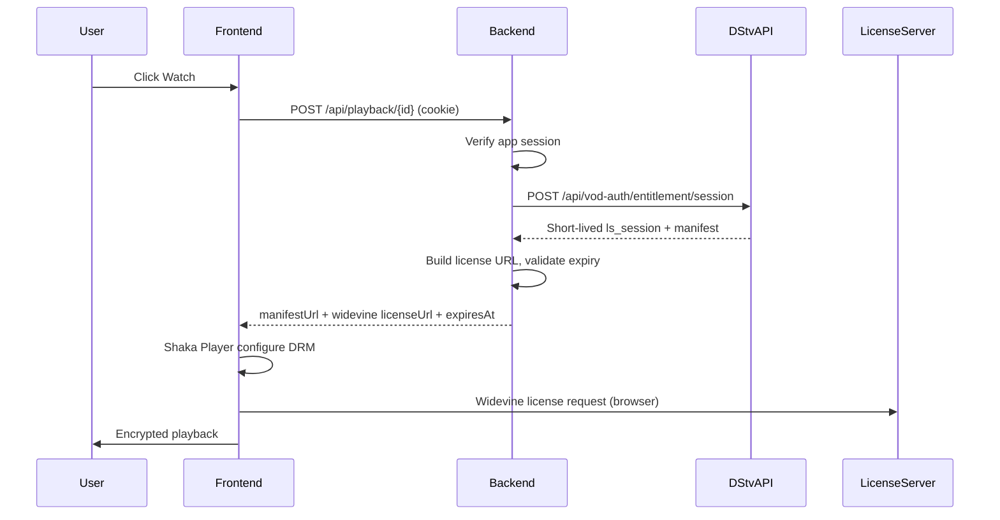

# StreamHub

Full-stack streaming dashboard built with **Next.js** and **FastAPI**. Browse categorized DStv-style catalog and live channel metadata, then request authorized playback configuration through a secure backend entitlement flow.

## Legal / DRM notice

This project is designed for **authorized use only**:

- Do **not** bypass DRM or Widevine protections.
- Do **not** scrape, capture, or hardcode browser tokens, cookies, or WAF headers.
- Do **not** store live user auth/session tokens in `.env`.
- Use **official DStv APIs** and **user-specific entitlement sessions** obtained through legitimate login/OAuth.
- DRM license URLs and manifest URLs are **short-lived** and generated **only after** backend entitlement validation.
- Never expose long-lived secrets to the frontend.
- Do **not** implement CORS-bypass proxies for protected license servers.

You must have a valid DStv subscription and rights to access content. This repository is a reference architecture, not a tool for unauthorized streaming.

## Project structure

```txt
/apps/frontend   Next.js 14 App Router + Shaka Player
/apps/backend    FastAPI + httpx DStv client
README.md
docker-compose.yml
.env.example
```

## Prerequisites

- Node.js 20+
- Python 3.11+
- Valid DStv account (for playback entitlement via official OAuth)

## Setup

### 1. Environment variables

Copy the example env file and adjust non-secret settings:

```bash
cp .env.example .env
cp .env.example apps/backend/.env
cp apps/frontend/.env.example apps/frontend/.env.local
```

**Never** put real user JWTs, WAF tokens, cookies, or DRM session tokens in `.env`. Those belong in short-lived server-side sessions after user login.

### 2. Backend

```bash
cd apps/backend
python -m venv .venv

# Windows
.venv\Scripts\activate

# macOS / Linux
source .venv/bin/activate

pip install -r requirements.txt
uvicorn app.main:app --reload --host 0.0.0.0 --port 8000
```

Backend health check: [http://localhost:8000/health](http://localhost:8000/health)

A demo user is created on startup:

- Email: `demo@streamhub.local`
- Password: `demo1234`

### 3. Frontend

```bash
cd apps/frontend
npm install
npm run dev
```

Open [http://localhost:3000](http://localhost:3000)

### 4. Docker (optional)

```bash
cp .env.example .env
docker compose up --build
```

## Environment variables

| Variable | Description |
|----------|-------------|
| `DSTV_API_BASE_URL` | DStv API base URL |
| `DSTV_LICENSE_BASE_URL` | Widevine license server base |
| `DSTV_PLATFORM_ID` | Platform identifier for API calls |
| `DSTV_COUNTRY_CODE` | Country code (e.g. `ZA`) |
| `DSTV_PACKAGE_ID` | Subscription package (e.g. `PREMIUM`) |
| `DSTV_CRM_ID` / `DSTV_ACCOUNT_ID` | License URL parameters |
| `BACKEND_CORS_ORIGINS` | Allowed frontend origins |
| `BACKEND_SECRET_KEY` | JWT signing key (app auth placeholder) |
| `NEXT_PUBLIC_API_URL` | Frontend → backend URL |

## API routes

| Method | Path | Description |
|--------|------|-------------|
| GET | `/health` | Backend status |
| GET | `/api/navigation` | Normalized navigation sections |
| GET | `/api/catalog/{section}` | VOD catalog (`movies`, `sport`, `tvshows`, `kids`, `home`) |
| GET | `/api/live/channels` | Live channels and current events |
| POST | `/api/playback/{content_id}` | Entitlement-validated playback config |
| POST | `/api/playback/stop` | Optional stream stop |
| POST | `/api/auth/login` | App login (httpOnly cookie) |
| POST | `/api/auth/link-dstv` | Link DStv OAuth tokens server-side |

## Playback flow



1. User signs in → backend sets **httpOnly** session cookie.
2. User links DStv account via `POST /api/auth/link-dstv` with tokens from **official OAuth** (stored server-side only).
3. User selects content → frontend calls backend playback endpoint.
4. Backend requests entitlement session from DStv using the user's linked token.
5. Backend returns short-lived manifest + license URL only if entitlement succeeds.
6. Shaka Player loads manifest and requests Widevine license directly from the license server.

## Troubleshooting

### CORS errors

- Ensure `BACKEND_CORS_ORIGINS` includes your frontend URL (default `http://localhost:3000`).
- Frontend requests use `credentials: "include"` for httpOnly cookies.
- Do **not** add a proxy to bypass license-server CORS — license requests are made by Shaka in the browser per Widevine design.

### 403 / entitlement denied

- Confirm the user is signed in (`POST /api/auth/login`).
- Link a valid DStv account (`POST /api/auth/link-dstv`) with tokens from the official login flow.
- Verify the subscription package matches content (`DSTV_PACKAGE_ID`).
- Check backend logs — tokens are redacted automatically.

### Expired entitlement session

- Entitlement `ls_session` tokens are short-lived (typically ~2 hours).
- Return to the dashboard and start playback again to request a fresh session.
- The player shows `SESSION_EXPIRED` if `expiresAt` has passed before load.

### License request failures

- Confirm Widevine is supported in your browser (Chrome, Edge, Firefox with CDM).
- Ensure the backend returned a complete license URL with `ls_session`.
- A 403 on license requests usually means entitlement expired or content is not included in the user's package.
- Check DevTools Network tab for the license request status (do not copy tokens into `.env`).

### Catalog empty / API errors

- Public catalog endpoints may require network access to `dstv.stream`.
- Navigation/catalog responses are cached; metadata cache TTL is configurable.
- Empty grids with no error often mean the upstream API returned no items for that section.

## Test Tab

The **Test** dashboard tab displays three fixed sport references:

| ID | Type | Notes |
|----|------|-------|
| `FHD` | Live | SuperSport FHD linear (`USL04/FHD/FHD.isml`) |
| `SS127028_SOC060626WCFBELVTUNHD10_SUN` | Streaming | FIFA World Cup highlight — *Belgium v Tunisia* (season catalogue) |
| `MSH` | Live | SuperSport Football |

These IDs are stable references only. Signed manifest URLs (`hdntl`, `hmac`) and DRM session tokens are **never** stored. When a user clicks **Watch**, the backend requests fresh playback configuration through `POST /api/playback/{content_id}` with `channelTag` / `manifestHint` where needed.

Metadata is loaded from `GET /api/test/videos`. If a single upstream metadata request fails, the backend still returns a fallback card for that ID.

## Development notes

- **Auth placeholder**: In-memory users/sessions — replace with DB + real OAuth.
- **Metadata caching**: Navigation and catalog only; DRM tokens are never cached.
- **Logging**: Sensitive values (JWTs, `ls_session`, Bearer tokens) are redacted in logs.
